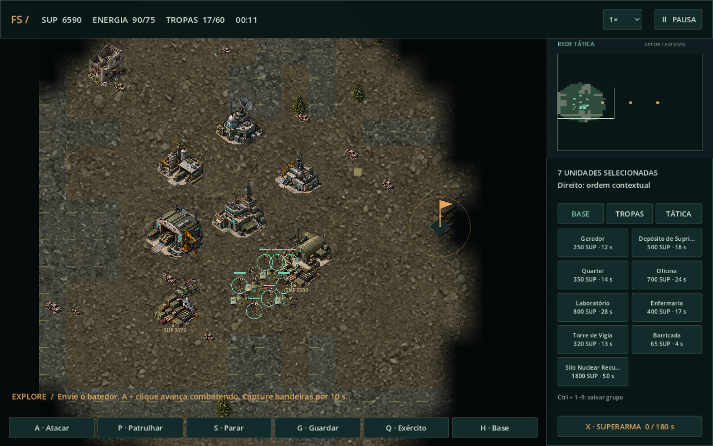

# Falling Skies: Guerra pela Terra

RTS de fã para Windows, em português, single-player e totalmente offline. Versão 1.0.

**[Baixar o jogo para Windows](https://github.com/TiagoRoque84/FallingSkiesRTS/releases/download/v1.0.0/FallingSkies-Windows.zip)** · [Versões publicadas](https://github.com/TiagoRoque84/FallingSkiesRTS/releases)

Extraia o ZIP e abra **FallingSkies.exe**. O botão **Code → Download ZIP** do GitHub baixa o código-fonte; o jogo pronto está em **Releases**.

## Abrir e jogar

Abra **JOGAR.cmd** ou **builds/FallingSkies.exe** com dois cliques. O executável contém o jogo, imagens e áudio; não precisa de editor, Python, instalação ou internet. Para copiar para outro lugar, extraia **builds/FallingSkies-Windows.zip** e abra o executável que está dentro.

No menu, escolha **Preparar operação**. Para aprender: **Escola da Resistência**, **Segunda Massachusetts**, **1 IA Casual** e **3.000 suprimentos**. Role a configuração para ver todas as opções.

1. O comando móvel começa selecionado. Pressione **D** para implantar.
2. Na aba **BASE**, escolha **Gerador** e clique perto do comando.
3. Construa **Depósito de Suprimentos**. Coletores enchem a carga e retornam à refinaria para creditar os recursos. A refinaria entrega um coletor adicional se houver vaga.
4. Construa **Quartel** e recrute na aba **TROPAS**. O custo é pago ao entrar na fila.
5. Explore com o batedor. **A + clique** avança combatendo. Ruínas oferecem abrigo; a mata reduz dano recebido.
6. Expanda na direção de novos depósitos, construa oficina e laboratório e destrua comandos inimigos ou cumpra o objetivo territorial.

Selecione uma construção de produção e clique direito no terreno para definir ponto de encontro. Em **TÁTICA**, cancele o último item da fila com reembolso ou pesquise armas (+15% de dano, 500 suprimentos, 35 s).

## Conteúdo

Três facções, seis mapas, um jogador humano contra até oito IAs, economia por coleta física, energia, construção, filas, expansão, tecnologias, cura, reparos, captura e conversão. Há seleção por caixa, grupos, patrulha, atacar-mover, guardar, minimapa, névoa por comandante, alertas, duas dificuldades, vitória por destruição ou domínio, pausa e placar. Arte original detalhada, tropas em oito direções, terreno texturizado e sombras incorporadas aos sprites.

| Mapa | Tamanho | Máximo de IAs |
| --- | --- | ---: |
| Escola da Resistência | Pequeno | 2 |
| Ruínas de Boston | Médio | 4 |
| Estrada para Charleston | Grande | 6 |
| Charleston Subterrânea | Médio | 4 |
| Zona da Torre Espheni | Gigante | 8 |
| Fazenda e floresta ocupadas | Grande | 6 |

Cenários usam geração determinística com regras de estradas, floresta, ruínas e posições. Mapas maiores têm mais recursos, pontos e expansão. O menu restringe adversários. A população é o menor valor entre 60 e 270 dividido pelo número de comandantes: com oito inimigos, 30 unidades por exército. Filas reservam vagas. Neutros opcionais ficam fora dessas cotas.

## Facções e habilidades

| Facção | Identidade | Herói e habilidade F | Superarma |
| --- | --- | --- | --- |
| Resistência | Equilíbrio e cura superior | Tom Mason: até 3 reforços, respeitando população | Nuclear: explosão e radiação por 18 s |
| Espheni | Unidades caras, resistentes e poderosas | Overlord: desativa inimigos na área por 5 s | Nêutrons: dano biológico alto e desativação por 14 s |
| Berserkers | Rapidez, recrutamento barato e suprimentos por abates | John Pope: explosivos em área | Termobárica: dispersão, área maior e fogo por 12 s |

Um herói principal por comandante. Após morrer, aguarde 90 s e pague um novo recrutamento. A aura dá +20% de dano a aliados a até 180 m. **F + clique** usa a habilidade a até 380 m; recarga 55 s.

Especiais usam F com recarga de 35 s: **Ben Mason** aplica interferência; **Controlador de Arnês** converte uma infantaria por 16 s; **Chefe de Saqueadores** retira até 400 suprimentos de um depósito perto do alvo. O laboratório desbloqueia heróis, especiais, elites e artilharia.

Superarmas precisam de laboratório e estrutura própria, custam 1.800 suprimentos, consomem 65 de energia e carregam em 180 s (140 s para Berserkers). O impacto é avisado com 7 s de antecedência no mapa e minimapa. **X + clique** escolhe um alvo visível. Um disparo não elimina sozinho um comando intacto. A IA também usa superarmas e precisa ver o alvo. Você pode desativá-las no Skirmish.

## Economia, cobertura e captura

ENERGIA mostra **geração/consumo**. Déficit reduz produção e construção a 30%, desliga torres e impede carregar/disparar superarmas normais. Enfermarias curam enquanto energizadas.

Depósitos se esgotam; regeneração opcional devolve 2 suprimentos por segundo. Estradas aceleram em 12%. Mata reduz velocidade para 72% e dano recebido em 22%. Clique direito numa ruína vazia com infantaria: a tropa recebe 55% menos dano e ganha alcance. Uma ordem de movimento retira a tropa.

Engenheiros reparam aliados próximos. Clique direito numa construção inimiga abaixo de 35% da vida para capturá-la ao se aproximar. Comandos não podem ser capturados; invencibilidade bloqueia captura e conversão.

## Cheats

Ative **Permitir cheats nesta partida** antes de começar. Pressione Esc para ver as quatro opções.

| Atalho | Opção |
| --- | --- |
| Ctrl+F1 | Recursos infinitos: gastos humanos não reduzem o saldo |
| Ctrl+F2 | Invencibilidade de unidades e construções humanas |
| Ctrl+F3 | Superarma instantânea da sua facção, mesmo sem silo |
| Ctrl+F4 | Revelar todo o mapa para o humano |

Cada atalho alterna a opção. Enquanto ativo, o cheat da superarma permite novos disparos imediatamente. Desligá-lo restaura requisitos normais. Revelação não altera visão da IA; desligá-la restaura a névoa. Recursos infinitos não concedem energia ilimitada.

O placar registra **Partida com cheats**. Reiniciar ou começar outra partida limpa as ativações. Remapeie as teclas em **Opções e controles**; Ctrl permanece como modificador.

## Controles

| Entrada | Ação |
| --- | --- |
| Clique esquerdo / arrastar | Selecionar unidade, prédio ou grupo |
| Shift + seleção | Adicionar à seleção |
| Clique direito | Mover, atacar, coletar, ocupar ruína ou definir ponto de encontro |
| A / P, depois clique | Atacar-mover / patrulhar |
| S / G | Parar / guardar |
| D | Implantar comando móvel |
| Q / H | Selecionar exército / voltar à base |
| F / X, depois clique | Habilidade / superarma |
| Ctrl+1…9 / 1…9 | Salvar / selecionar grupo |
| Setas / arrastar botão central | Mover câmera |
| Roda | Zoom |
| Clique / direito no minimapa | Reposicionar câmera / mover tropas |
| Esc | Cancelar ordem armada ou abrir/fechar pausa |

## Desempenho e limites

Testado em **Core i3-7100, 16 GB de RAM e Intel HD Graphics 630**. O Godot escolheu automaticamente Compatibility com ANGLE/Direct3D 11. Nenhum driver ou ajuste do Windows foi alterado. Medições finais e condições estão em **docs/TESTES.md** e nos JSON de **tests/**.

No executável final, as janelas de teste de 45 segundos registraram **57,9 FPS de média no cenário 1 × 1** e **42,5 FPS no gigante com oito IAs e população inicial máxima**. São cenários preparados de diagnóstico, não garantia de FPS constante.

O visual usa sprites detalhados com volume pré-renderizado. Não é reprodução dos arquivos de Command & Conquer nem um jogo 3D fotorrealista. Funções de infantaria compartilham modelos-base, diferenciados por tamanho, nome e marcadores. A locomoção usa orientações e oscilação leve, sem animação esquelética. Mapas seguem layouts por regras. Não há campanha, multiplayer ou salvamento de partidas em andamento.

## Editar e exportar

1. Abra **tools/godot/Godot_v4.7.2-stable_win64.exe** e importe **project.godot**. F5 executa o projeto.
2. Ajuste unidades, construções e facções em **data/content.json**, IA em **data/ai.json** e catálogo em **data/maps.json**.
3. Simulação: **src/battle.gd**. Mapas: **src/battle_map.gd**. IA: **src/commander_ai.gd**. Menus: **src/main.gd**. Renderização: **src/battle_view.gd**, **sprite_bank.gd** e **sprite_batch.gd**.
4. No PowerShell dentro desta pasta, execute **./scripts/build.ps1**. Ele importa recursos, roda testes de regras e gera o executável com pacote embutido.

Na cópia original deste projeto, motor e modelos já estão em **tools/**. Essas dependências, os executáveis de **builds/** e o cache **.godot/** ficam fora do Git. Ao clonar do GitHub, obtenha o **Godot 4.7.2 Standard para Windows** e os **templates de exportação 4.7.2** no [site oficial do Godot](https://godotengine.org/download/windows/). Extraia o editor em **tools/godot/** e os templates **windows_release_x86_64.exe** e **windows_debug_x86_64.exe** em **tools/templates/** para usar o script de build. Para apenas jogar, use o pacote em Releases.

**scripts/generate_content.py** recria dados-base e áudio, sobrescrevendo content.json; preserve seus ajustes antes de executá-lo. Artes e prompts estão em **assets/sprites/** e **docs/**.

Testes, a partir da pasta do projeto:

    & './tools/godot/Godot_v4.7.2-stable_win64_console.exe' --headless --path . --script tests/rules.gd
    & './tools/godot/Godot_v4.7.2-stable_win64_console.exe' --headless --path . --script tests/advanced.gd
    & './tools/godot/Godot_v4.7.2-stable_win64_console.exe' --headless --path . --script tests/matches.gd
    & './tools/godot/Godot_v4.7.2-stable_win64_console.exe' --path . --script tests/ui_flow.gd

As preferências ficam em **settings.cfg**, no diretório de dados do jogo em **%APPDATA%/Godot/app_userdata/**. O subdiretório logs contém o log. Somente opções são salvas. Código, arte, documentação e testes estão publicados neste repositório; o pacote portátil é distribuído em Releases.

## Créditos

Programação, arte e áudio produzidos com assistência do Codex. Imagens criadas pelo ImageGen integrado, usadas como atlas transparentes; prompts preservados em docs. Trilha e efeitos sintetizados matematicamente, sem amostras externas.

**Godot 4.7.2**, licença MIT: avisos completos em **LICENSES/GODOT.txt** e **LICENSES/THIRD_PARTY.txt**. Projeto pessoal de fã, gratuito e sem finalidade comercial. Nomes e referências a Falling Skies pertencem aos respectivos titulares. Nenhum arquivo foi extraído da série ou de Command & Conquer.
